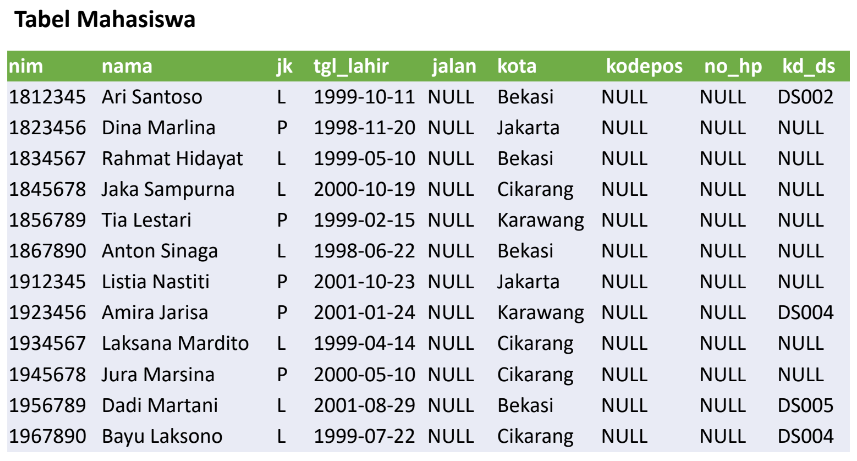
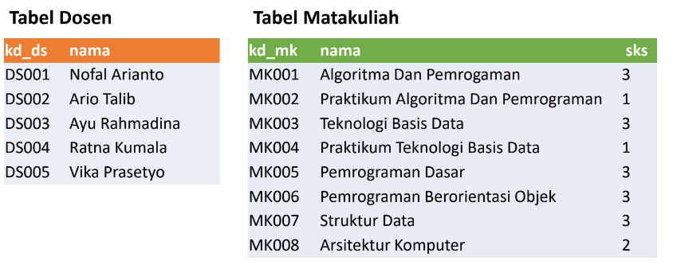
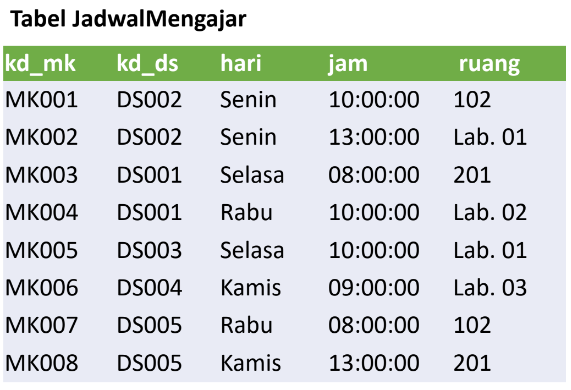
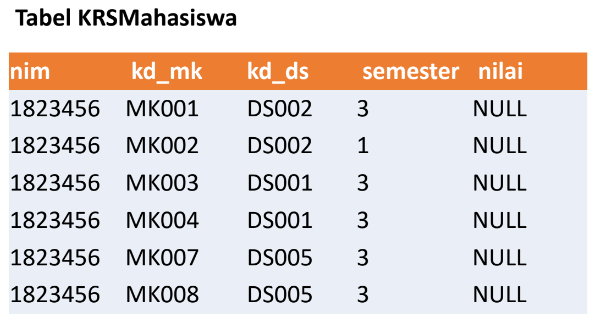

# Tugas Praktikum { Pertemuan ke 12 }
 

 ## Profil
| Variable | Isi |
| -------- | --- |
| **Nama** | Muhammad Faiz Iqbal |
| **NIM** | 312310491 |
| **Kelas** | TI.23.A.5 |
| **Mata Kuliah** | Basis data |

# Soal Latihan Praktikum 









## Latihan

- Lakukan join table Mahasiswa dan Dosen.
- Lakukan join tabel Matakuliah dan Dosen.
- Lakukan join table JadwalMengajar, Dosen, dan Matakuliah.
- Lakukan join tabel KrsMahasiswa, Mahasiswa, Matakuliah, dan Dosen.

## Buat Script SQL JOIN Table berdasarkan skema data diatas.

```
CREATE DATABASE Praktikum5;

USE Praktikum5;

CREATE TABLE Mahasiswa(
nim VARCHAR(50) NOT NULL,
nama VARCHAR(100) NOT NULL,
jk VARCHAR(20) NOT NULL,
tgl_lahir VARCHAR(30) NOT NULL,
jalan VARCHAR(30) DEFAULT NULL,
Kota VARCHAR(50) NOT NULL,
kodepos VARCHAR(20) DEFAULT NULL,
no_hp VARCHAR(20) DEFAULT NULL,
kd_ds VARCHAR(20) DEFAULT NULL
);

ALTER TABLE `praktikum5`.`mahasiswa` 
ADD PRIMARY KEY (`nim`);


INSERT INTO `praktikum5`.`Mahasiswa` (`nim`, `nama`, `jk`, `tgl_lahir`, `Kota`, `kd_ds`) VALUES ('1812345', 'Ari Santoso', 'L', '1999-10-11', 'Bekasi', 'DS002');
INSERT INTO `praktikum5`.`Mahasiswa` (`nim`, `nama`, `jk`, `tgl_lahir`, `Kota`) VALUES ('1823456', 'Dina Marlina', 'P', '1998-11-20', 'Jakarta');
INSERT INTO `praktikum5`.`Mahasiswa` (`nim`, `nama`, `jk`, `tgl_lahir`, `Kota`) VALUES ('1834567', 'Rahmat Hidayat', 'L', '1999-05-10', 'Bekasi');
INSERT INTO `praktikum5`.`Mahasiswa` (`nim`, `nama`, `jk`, `tgl_lahir`, `Kota`) VALUES ('1845678', 'Jaka Sampurna', 'L', '2000-10-19', 'Cikarang');
INSERT INTO `praktikum5`.`Mahasiswa` (`nim`, `nama`, `jk`, `tgl_lahir`, `Kota`) VALUES ('1856789', 'Tia Lestari', 'P', '1999-02-15', 'Karawang');
INSERT INTO `praktikum5`.`Mahasiswa` (`nim`, `nama`, `jk`, `tgl_lahir`, `jalan`, `Kota`) VALUES ('1867890', 'Anton Sinaga', 'L', '1998-06-22', '', 'Bekasi');
INSERT INTO `praktikum5`.`Mahasiswa` (`nim`, `nama`, `jk`, `tgl_lahir`, `Kota`) VALUES ('1912345', 'Listia Nastiti', 'P', '2001-10-23', 'Jakarta');
INSERT INTO `praktikum5`.`Mahasiswa` (`nim`, `nama`, `jk`, `tgl_lahir`, `Kota`, `kd_ds`) VALUES ('1923456', 'Amira Jarisa', 'P', '2001-01-24', 'Karawang', 'DS004');
INSERT INTO `praktikum5`.`Mahasiswa` (`nim`, `nama`, `jk`, `tgl_lahir`, `Kota`) VALUES ('1934567', 'Laksana Mardito', 'L', '1999-04-14', 'Cikarang');
INSERT INTO `praktikum5`.`Mahasiswa` (`nim`, `nama`, `jk`, `tgl_lahir`, `Kota`) VALUES ('1945678', 'Jura Marsina', 'p', '2000-05-10', 'Cikarang');
INSERT INTO `praktikum5`.`Mahasiswa` (`nim`, `nama`, `jk`, `tgl_lahir`, `Kota`, `kd_ds`) VALUES ('1956789', 'Dadi Martani', 'L', '2001-08-29', 'Bekasi', 'DS005');
INSERT INTO `praktikum5`.`Mahasiswa` (`nim`, `nama`, `jk`, `tgl_lahir`, `Kota`, `kd_ds`) VALUES ('1967890', 'Bayu Laksono', 'L', '1999-07-22', 'Cikarang', 'DS004');

SELECT * FROM Mahasiswa;


CREATE TABLE Dosen(
kd_ds VARCHAR(50) NOT NULL PRIMARY KEY,
nama VARCHAR(100) NOT NULL
);

INSERT INTO `praktikum5`.`Dosen` (`kd_ds`, `nama`) VALUES ('DS001', 'Nofal Arianto');
INSERT INTO `praktikum5`.`Dosen` (`kd_ds`, `nama`) VALUES ('DS002', 'Ario Talib');
INSERT INTO `praktikum5`.`Dosen` (`kd_ds`, `nama`) VALUES ('DS003', 'Ayu Rahmadina');
INSERT INTO `praktikum5`.`Dosen` (`kd_ds`, `nama`) VALUES ('DS004', 'Ratna Kumala');
INSERT INTO `praktikum5`.`Dosen` (`kd_ds`, `nama`) VALUES ('DS005', 'Vika Prasetyo');

SELECT * FROM Dosen;

CREATE TABLE Matakuliah(
kd_mk VARCHAR(50) NOT NULL PRIMARY KEY,
nama VARCHAR(100) NOT NULL,
sks VARCHAR(10)
);

INSERT INTO `praktikum5`.`Matakuliah` (`kd_mk`, `nama`, `sks`) VALUES ('MK001', 'Algoritma Dan Pemrograman', '3');
INSERT INTO `praktikum5`.`Matakuliah` (`kd_mk`, `nama`, `sks`) VALUES ('MK002', 'Praktikum Algoritma Dan Pemrograman', '1');
INSERT INTO `praktikum5`.`Matakuliah` (`kd_mk`, `nama`, `sks`) VALUES ('MK003', 'Teknologi Basis Data', '3');
INSERT INTO `praktikum5`.`Matakuliah` (`kd_mk`, `nama`, `sks`) VALUES ('MK004', 'Praktikum Teknologi Basis Data', '1');
INSERT INTO `praktikum5`.`Matakuliah` (`kd_mk`, `nama`, `sks`) VALUES ('MK005', 'Pemrograman Dasar', '3');
INSERT INTO `praktikum5`.`Matakuliah` (`kd_mk`, `nama`, `sks`) VALUES ('MK006', 'Pemrograman Berorientasi Objek', '3');
INSERT INTO `praktikum5`.`Matakuliah` (`kd_mk`, `nama`, `sks`) VALUES ('MK007', 'Struktur Data', '3');
INSERT INTO `praktikum5`.`Matakuliah` (`kd_mk`, `nama`, `sks`) VALUES ('MK008', 'Arsitektur Komputer', '2');

SELECT * FROM Matakuliah;

CREATE TABLE JadwalMengajar(
kd_mk VARCHAR(50) NOT NULL,
kd_ds VARCHAR(50) NOT NULL,
hari ENUM('Senin', 'Selasa', 'Rabu', 'Kamis'),
jam TIME NOT NULL,
ruang VARCHAR(50),
PRIMARY KEY(kd_mk, kd_ds)
);

INSERT INTO `praktikum5`.`JadwalMengajar` (`kd_mk`, `kd_ds`, `hari`, `jam`, `ruang`) VALUES ('MK001', 'DS002', 'Senin', '10:00:00', '102');
INSERT INTO `praktikum5`.`JadwalMengajar` (`kd_mk`, `kd_ds`, `hari`, `jam`, `ruang`) VALUES ('MK002', 'DS002', 'Senin', '13:00:00', 'Lab. 01');
INSERT INTO `praktikum5`.`JadwalMengajar` (`kd_mk`, `kd_ds`, `hari`, `jam`, `ruang`) VALUES ('MK003', 'DS001', 'Selasa', '08:00:00', '201');
INSERT INTO `praktikum5`.`JadwalMengajar` (`kd_mk`, `kd_ds`, `hari`, `jam`, `ruang`) VALUES ('MK004', 'DS001', 'Rabu', '10:00:00', 'Lab. 02');
INSERT INTO `praktikum5`.`JadwalMengajar` (`kd_mk`, `kd_ds`, `hari`, `jam`, `ruang`) VALUES ('MK005', 'DS003', 'Selasa', '10:00:00', 'Lab. 01');
INSERT INTO `praktikum5`.`JadwalMengajar` (`kd_mk`, `kd_ds`, `hari`, `jam`, `ruang`) VALUES ('MK006', 'DS004', 'Kamis', '09:00:00', 'Lab. 03');
INSERT INTO `praktikum5`.`JadwalMengajar` (`kd_mk`, `kd_ds`, `hari`, `jam`, `ruang`) VALUES ('MK007', 'DS005', 'Rabu', '08:00:00', '102');
INSERT INTO `praktikum5`.`JadwalMengajar` (`kd_mk`, `kd_ds`, `hari`, `jam`, `ruang`) VALUES ('MK008', 'DS005', 'Kamis', '13:00:00', '201');

SELECT * FROM JadwalMengajar;

CREATE TABLE KRSMahasiswa(
nim VARCHAR(50) NOT NULL,
kd_mk VARCHAR(50) NOT NULL,
kd_ds VARCHAR(50) NOT NULL,
semester VARCHAR(30) NOT NULL,
nilai VARCHAR(50) DEFAULT NULL
);

ALTER TABLE `praktikum5`.`krsmahasiswa` 
ADD PRIMARY KEY (`nim`, `kd_mk`, `kd_ds`);
;

INSERT INTO `praktikum5`.`KRSMahasiswa` (`nim`, `kd_mk`, `kd_ds`, `semester`) VALUES ('1823456', 'MK001', 'DS002', '3');
INSERT INTO `praktikum5`.`KRSMahasiswa` (`nim`, `kd_mk`, `kd_ds`, `semester`) VALUES ('1823456', 'MK002', 'DS002', '1');
INSERT INTO `praktikum5`.`KRSMahasiswa` (`nim`, `kd_mk`, `kd_ds`, `semester`) VALUES ('1823456', 'MK003', 'DS001', '3');
INSERT INTO `praktikum5`.`KRSMahasiswa` (`nim`, `kd_mk`, `kd_ds`, `semester`) VALUES ('1823456', 'MK004', 'DS001', '3');
INSERT INTO `praktikum5`.`KRSMahasiswa` (`nim`, `kd_mk`, `kd_ds`, `semester`) VALUES ('1823456', 'MK007', 'DS005', '3');
INSERT INTO `praktikum5`.`KRSMahasiswa` (`nim`, `kd_mk`, `kd_ds`, `semester`) VALUES ('1823456', 'MK008', 'DS005', '3');

SELECT * FROM KRSMahasiswa;

SELECT Mahasiswa.nim, Mahasiswa.nama, Mahasiswa.jk, Dosen.nama AS "Dosen PA"
FROM Mahasiswa INNER JOIN Dosen ON Dosen.kd_ds = Mahasiswa.kd_ds;

SELECT Mahasiswa.nim, Mahasiswa.nama, Mahasiswa.jk, Dosen.nama AS "Dosen PA"
FROM Mahasiswa LEFT JOIN Dosen ON Dosen.kd_ds = Mahasiswa.kd_ds;

SELECT Matakuliah.kd_mk, Matakuliah.nama, Matakuliah.sks, Dosen.nama AS "Dosen Pengampu"
FROM JadwalMengajar
LEFT JOIN Matakuliah ON JadwalMengajar.kd_mk = Matakuliah.kd_mk
LEFT JOIN Dosen ON JadwalMengajar.kd_ds = Dosen.kd_ds;

SELECT Matakuliah.kd_mk, Matakuliah.nama, Matakuliah.sks, Dosen.nama AS "Dosen Pengampu", JadwalMengajar.hari, JadwalMengajar.jam, JadwalMengajar.ruang
FROM JadwalMengajar
LEFT JOIN Matakuliah ON JadwalMengajar.kd_mk = Matakuliah.kd_mk
LEFT JOIN Dosen ON JadwalMengajar.kd_ds = Dosen.kd_ds;

SELECT Mahasiswa.nim, Mahasiswa.nama AS "nama", Dosen.nama AS "Dosen PA", Matakuliah.nama AS "Matakuliah", Matakuliah.sks, Dosen.nama AS "Dosen Pengampu"
FROM KRSMahasiswa
JOIN Mahasiswa ON KRSMahasiswa.nim = Mahasiswa.nim
JOIN Matakuliah ON KRSMahasiswa.kd_mk = Matakuliah.kd_mk
JOIN Dosen ON KRSMahasiswa.kd_ds = Dosen.kd_ds;
```

### Buat laporan praktikum yang berisi, langkah-langkah praktikum beserta screenshot yang sudah dilakukan dalam bentuk dokumen.


- [Link Laporan Praktikum](https://drive.google.com/file/d/1AFBFiZr0M8eRS6clZxMmKlaIo_yhDOIB/view?usp=drivesdk)

## SELESAI  
## TERIMAKASIH
